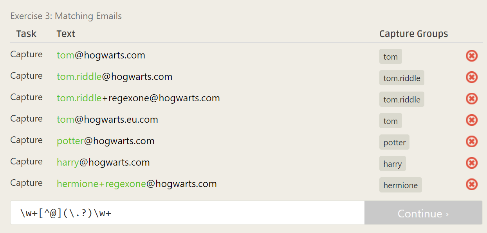
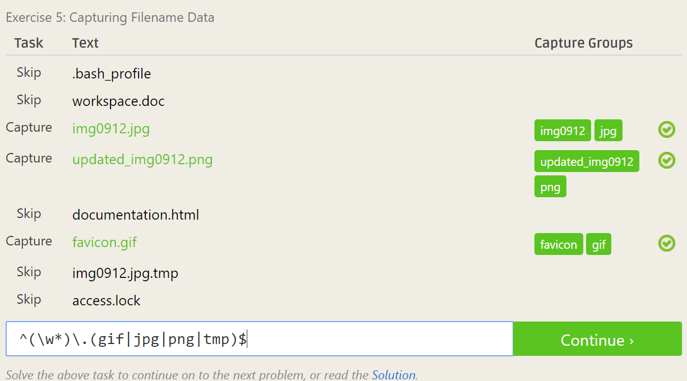
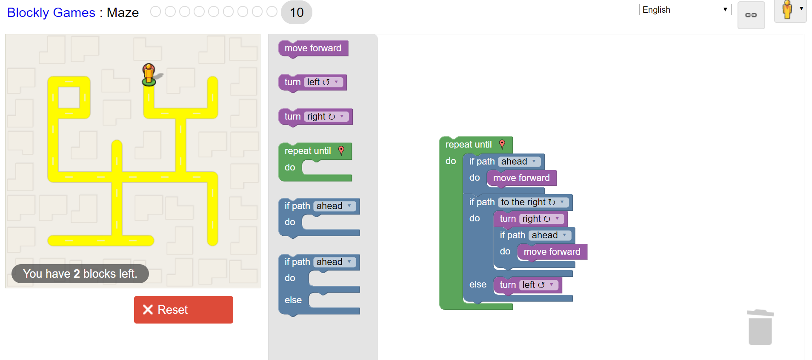

# Lab1
## Reading Reflections

### Smart Questions
****This was touched upon in the article, but often I keep a running list of solutions I've tried and the resulting outcomes. This helps other people understand my confusion, or if it's in the case of getting some piece of code to work, it helps me and other backtrace where things may have gone astray.

### Free Culture
It's really unfortunate that Jesse had to pick the lesser of two evils just for 'tinkering' with the search engine. I think that his story is a warning for anyone who sees themselves as just 'tinkering with technology' - it's important to be wary of all the people/corporations/organizations that can come after you before releasing something. The engine that Jesse made went on-line pretty quickly, so he probably didn't even take much time to consider all the ways people might use his engine (such as putting music files up there) as well as the possibility that organizations outside of RPI could come for him. Regardless, he shouldn't have had to be punished so cruelly for trying to extend his technical knowledge. This chapter made it clear to me that, even though I may have very pure intentions with the technology I work on, it can still be misused by users, either deliberately, or, as in Jesse's case, without even realizing it. The misuse of the technology I work on can have serious consequences because I am the one who built it and enabled the misuse of it.

## RegexOne
Here are screenshots of the solved RegexOne problems. There were some problems that took me a while and I added some photos of the thought process I had.  
1  
  
  
2  
  
3  
  
  
4  
  
5  
  
6  
  
7  
  

## Regex Crosswords
Here are screenshots of the solved Regex Crosswords (I couldn't figure out 2 and 3 of the beginner problems, but managed to solve 1 and 2 of the intermediate to make up for it)  
* Beatles  
  
* Symbolism  
  
* Airstrip One  
  
* Always Remember  
  
* Johnny  
  

## Blockly
This is my solution to the blockly challenge.  
  

## Reflection
I'm currently working on an open source project called AutoCalendar. I started it for RCOS last semester and I am still working on it. I have another idea for an open source project though. It is similar to one of the RCOS projects Second String, so I think I can build off of what they have. The idea is a program to predict ideal picks for fantasy football teams (or other fantasy teams). I think it would be a cool exploration of predictive analysis and graph theory algorithms.  
I looked through open source projects and I found a couple that stood out to me. One is called [VisPy](https://github.com/vispy/vispy), an interactive 2D/3D data visualization library. I personally want to explore computer graphics, so this project seems to be in that area. I also found a project called [Mimesis](https://github.com/lk-geimfari/mimesis) that generates fake data to be used for testing (or anything else that you might need some fake data for). These two projects use Python, which I am familiar with. [EME](https://github.com/egoist/eme) is a markdown editor similar to Brackets that renders markdown files. I think it's a great tool to learn markdown, however, it doesn't look like this project has been very active in the past couples years.