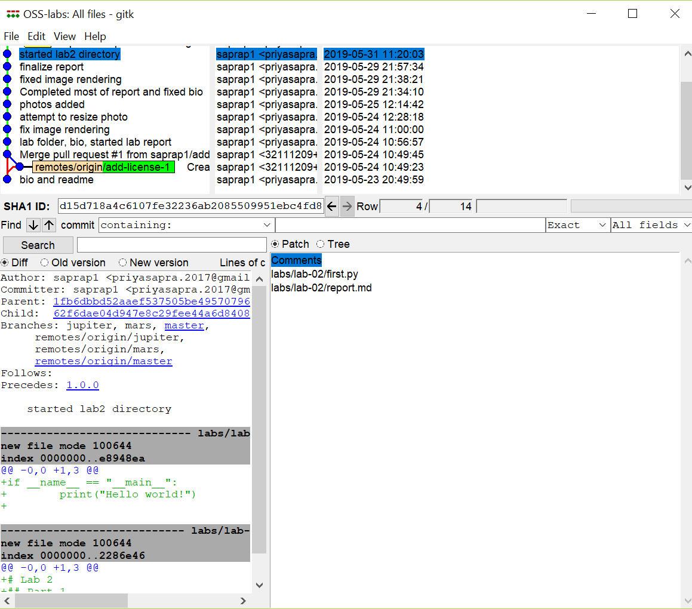
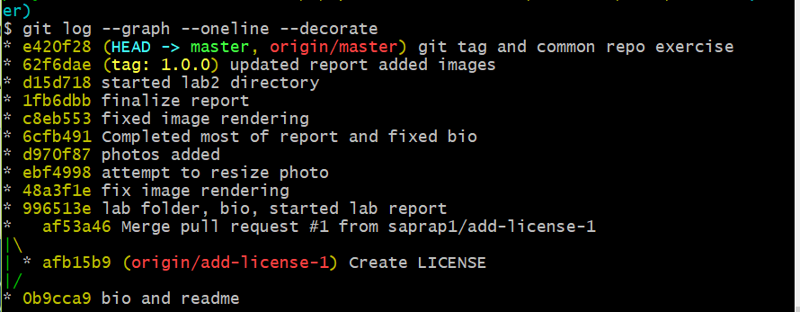
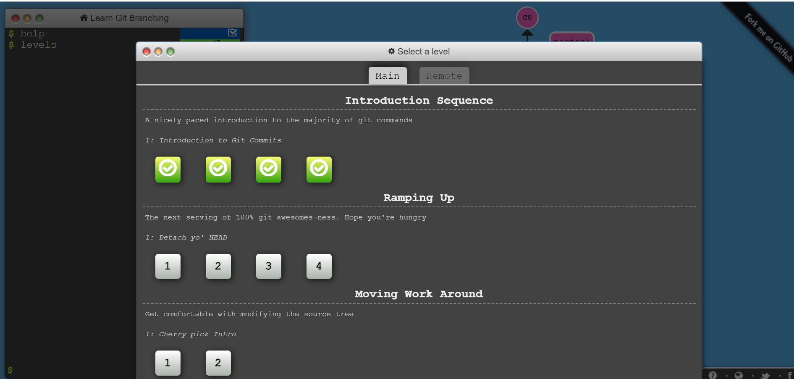
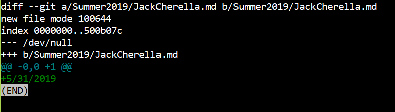
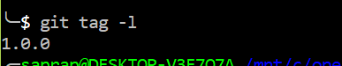

# Lab 2
## Part 1
Link to part 1 [here](https://github.com/saprap1/lab2part1)  
* Gitk  
  
* Git log graph  
  

## Part 2  
(I actually had SpoonKnife forked from when I started learning Git for RCOS my freshman year.)  
Link to [SpoonKnife](https://github.com/saprap1/Spoon-Knife)  
Learn Git branching  
   

## Part 3
* Forked PR repo can be found [here](https://github.com/saprap1/PullReq) 
* Git diff screenshot:  
  
* Git tag screenshot:  
  
* Link to the table's common repository can be found [here](https://github.com/oakleyaidan21/OSSProjectIdeas/tree/master/Spring2019)  

