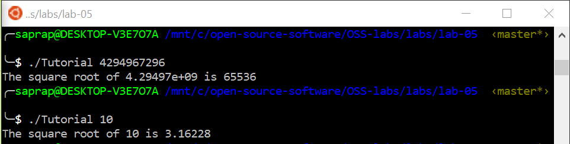
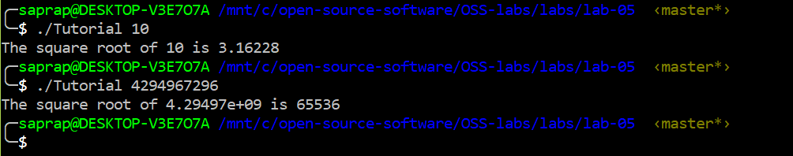

# Lab 5

I was out sick for the week when this lab took place. I have lots of questions about it, but I will come into office hours to ask them adter the break, even if the lab has already been graded.  

## Cmake Tutorial
- Here are the results from running the Tutorial executable  
Steps 1 and 2:  
  
Step 5:
  

- Had some trouble setting up install and running tests. Can't find install directory and tests to be run can't be found even though a testing directory was made.   

## Makefile for LabExample
- [Here](./LabExample/Makefile) is the link to my Makefile (makefile still gives an error, I suspect it's something to do with my $PATH but I haven't been able to figure it out)  
- [Here](./LabExample/CMakeLists.txt) is the link to my CMakeLists.txt  
