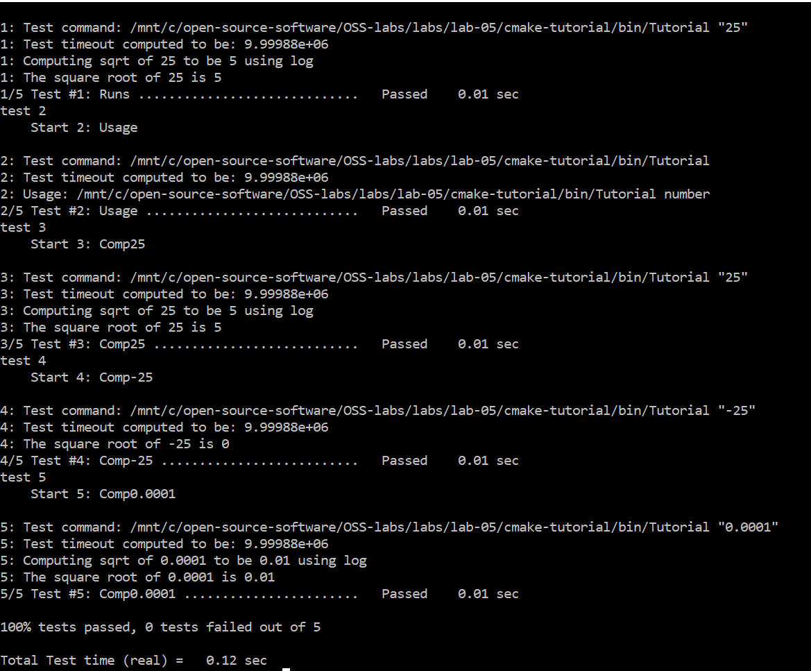
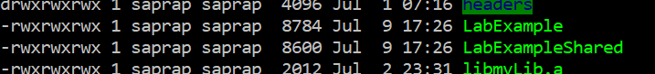

# Lab 5

## Cmake Tutorial
- Here are the results from running the Tutorial executable  
Steps 1 and 2:  
  
Step 4 ```ctest -VV```:  
  
Step 5:  
  

## Makefile for LabExample
- [Here](./Lab-Example/Makefile) is the link to my Makefile.

- [Here](./Lab-Example/CMakeLists.txt) is the link to my CMakeLists.txt  

- Results from ```ls -la``` for comparing the sizes of static and shared libraries  
  