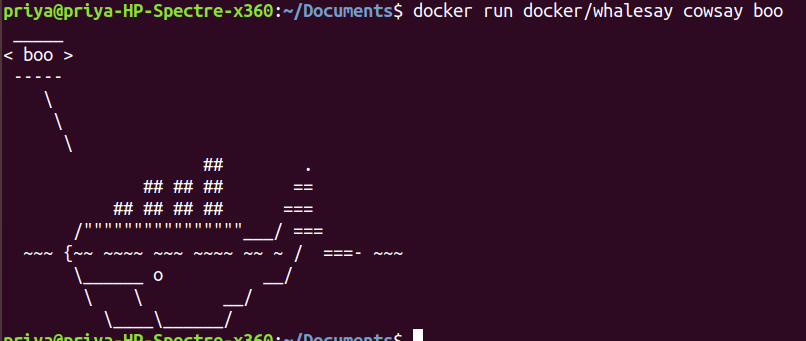
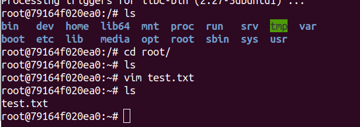
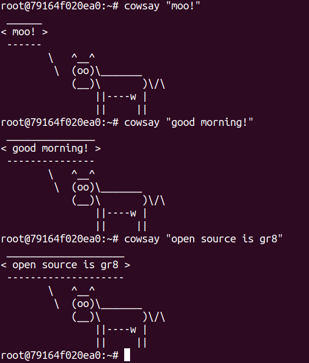
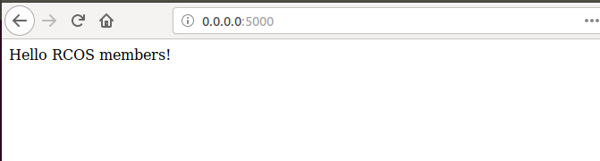
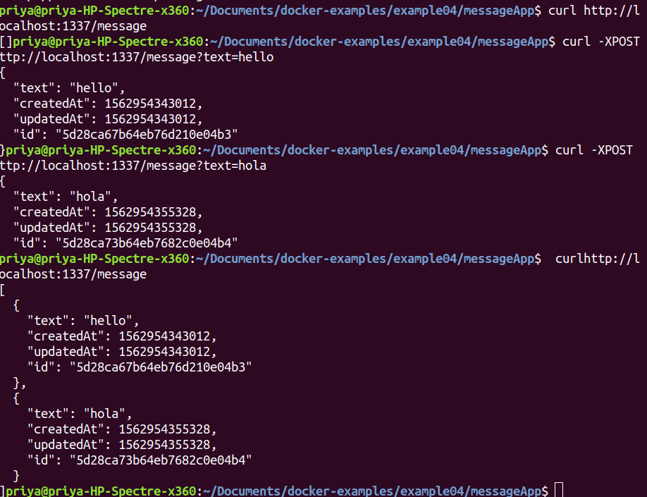
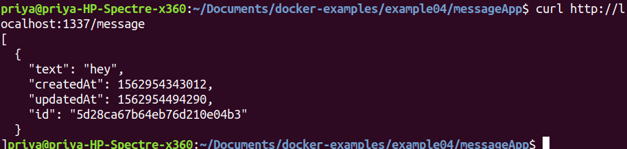

## Lab 6

# Example 00
Scary whale:  
  

# Example 01
Made a test file in root:  
  
Cowsay:  
  

# Example 02
Was able to get Mongo and RocketChat containers runnning, however, had an issue connecting to the port on localhost. It looks like the port gets forwarded when I do a ```docker ps```, but localhost:3000 never makes a connection and loads.  

# Example 03
It was very sraightforward to make the Dockerfile and get the hello server running:  
  
The code for this can be found [here](https://github.com/saprap1/OSS-labs/tree/master/labs/lab-06/hello-docker)

# Example 04
I was able to successfully set up the app with [Dockerfile](https://github.com/saprap1/OSS-labs/tree/master/labs/lab-06/messageApp/Dockerfile) and [docker-compose.yml](https://github.com/saprap1/OSS-labs/tree/master/labs/lab-06/messageApp/docker-compose.yml)  
Made some messages:  
  
Changed a message and deleted the other message:  
  

