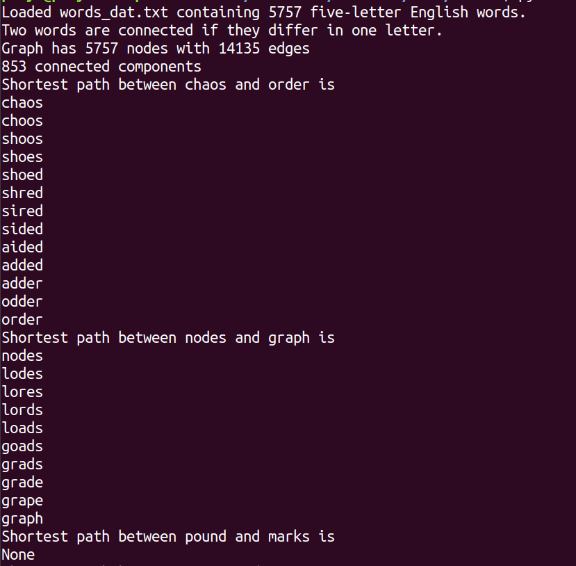
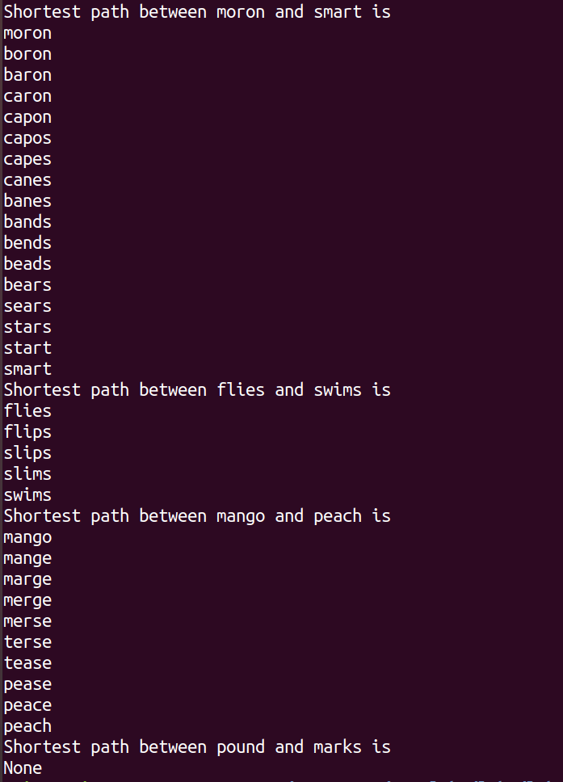
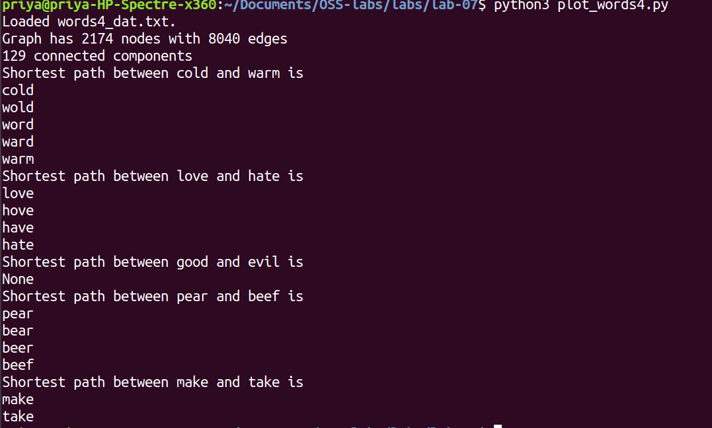
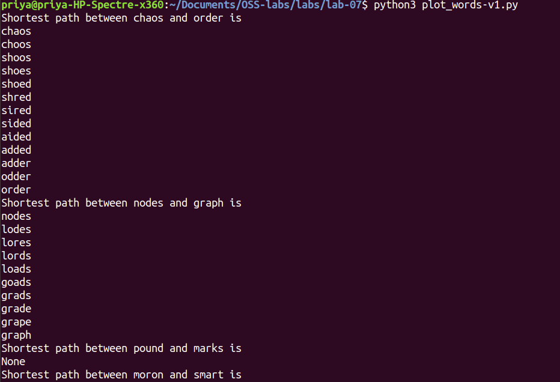
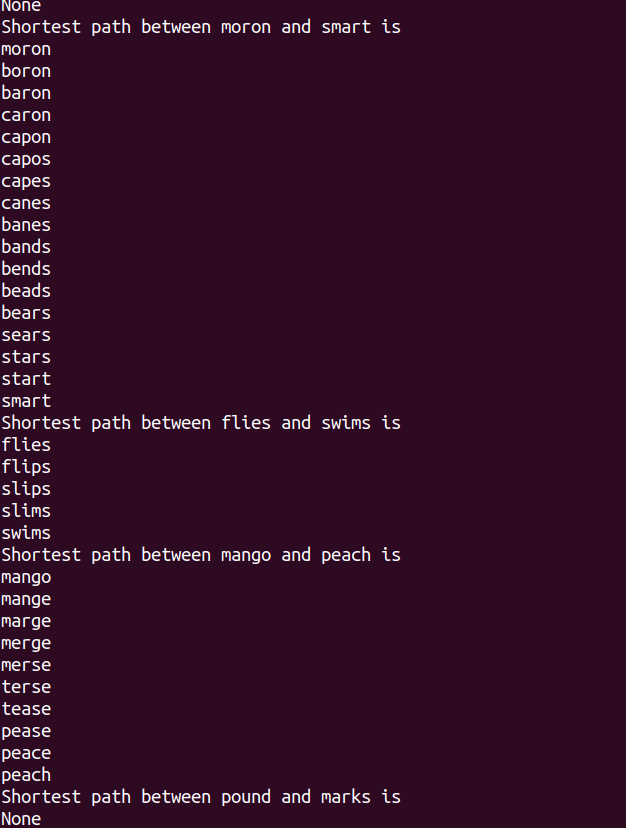

# Lab 7 - Scientific Computing

## Exercise 1 - modify base code to test some more pairs of length 5 words
See the modified file [here](https://github.com/saprap1/OSS-labs/lab-07/plot_words.py)  
   

## Exercise 2 - new version of code for length 4 words
All I changed was the following in the `words_graph()` function:  
```
PUT CODE HERE
```

As well as this in `main()`:  
```
PUT CODE HERE
```

See the modified file [here](https://github.com/saprap1/OSS-labs/lab-07/plot_words4.py)  
  

## Exercise 3 - variation with adjacency being any letter without regard to ordering
I added a for loop in the `edit_distance()` function:  
```
PUT CODE HERE
```
    

See the modified file [here](https://github.com/saprap1/OSS-labs/lab-07/plot_words-v1.py)
