# Lab 8

## ggplot exercises
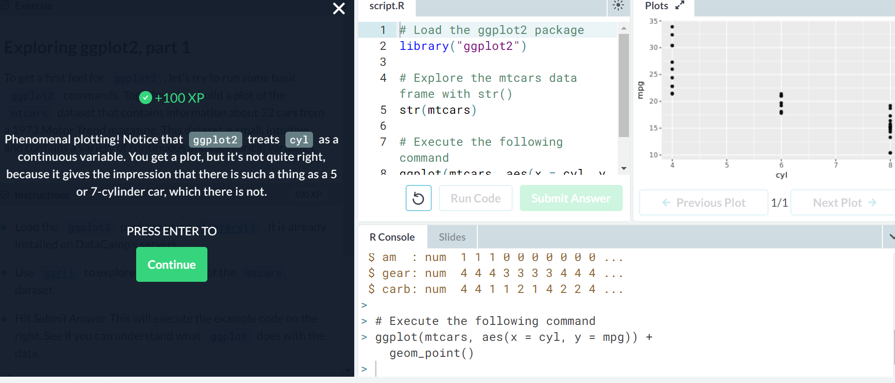  
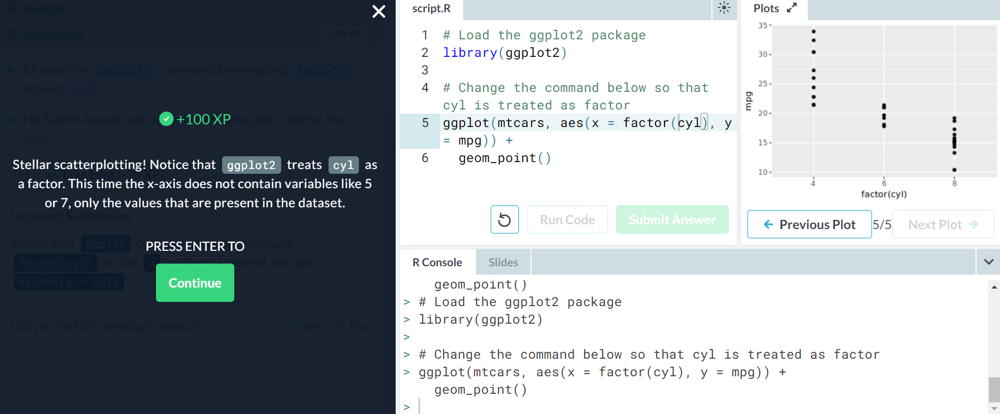  
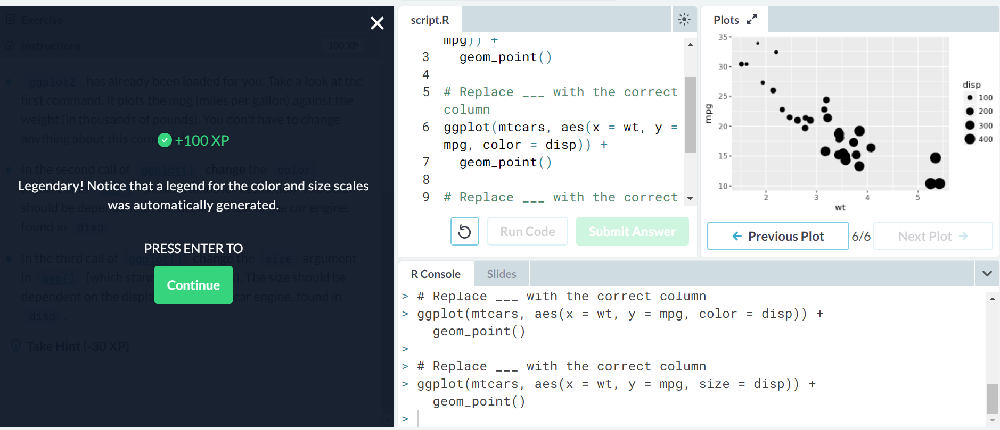  
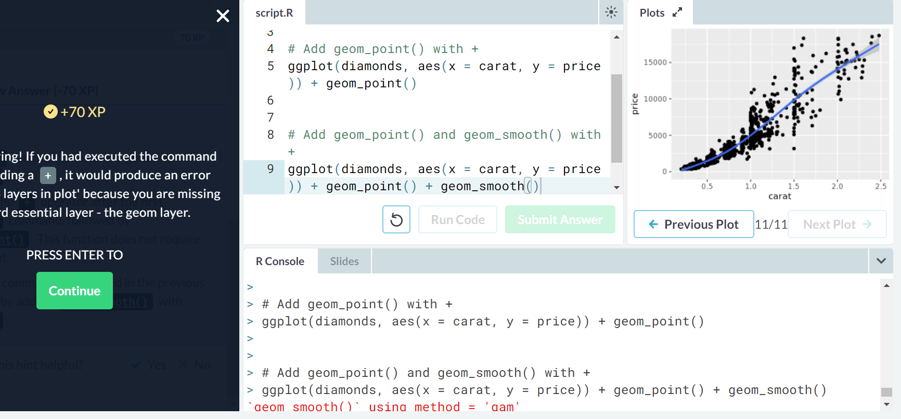  
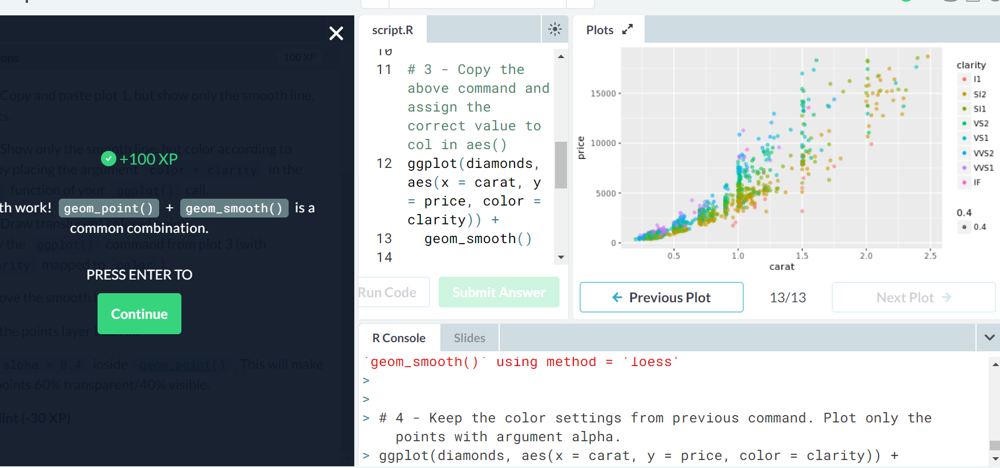  
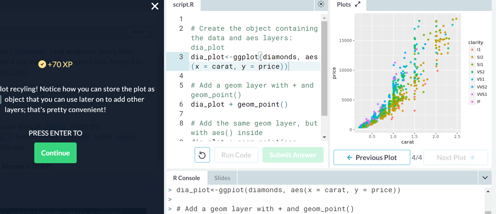  
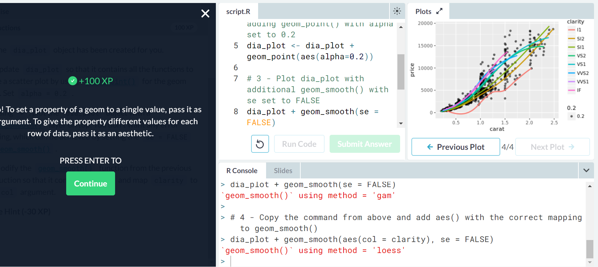  

## Parallel Slopes lesson of "Multiple and Logistic Regression"
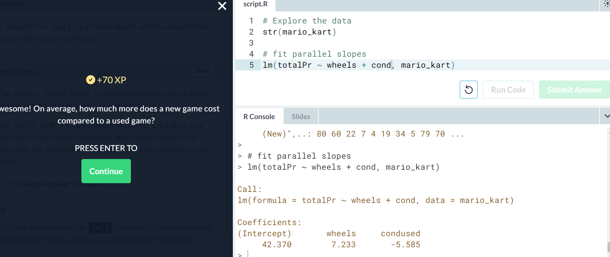  
I found this exercise to be particularly frustrating because the instructions about what needed to be plotted were pretty vague  
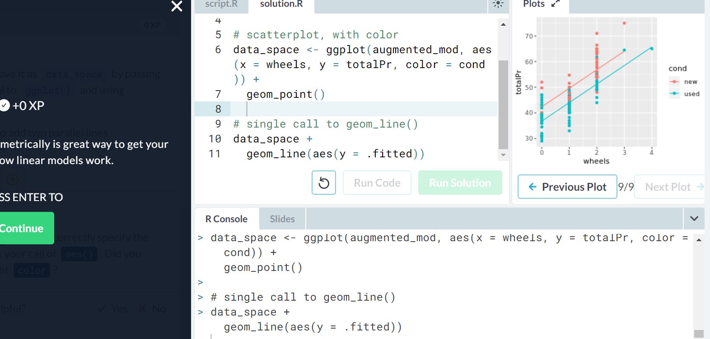  
I don't know why I got 0 points on this one... I kept getting an error when I used "birthweight ~ age + parity"  
(edit - I just realized that bwt is labeled as such)  
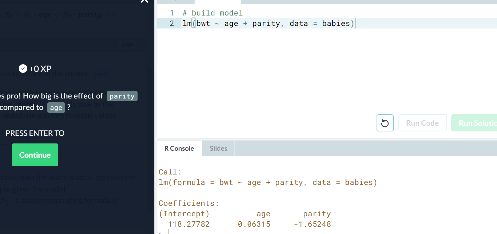  
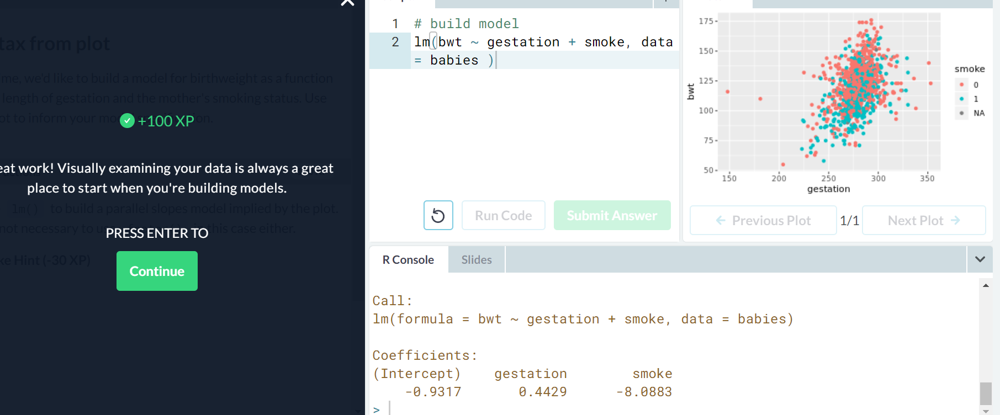  

## Observatory link
[Here](https://rcos.io/projects/saprap1/ftp/profile) is a link to my project's profile page on rcos.io  
[Here](https://rcos.io/projects/saprap1/ftp/blog) is a link to the project blog.  