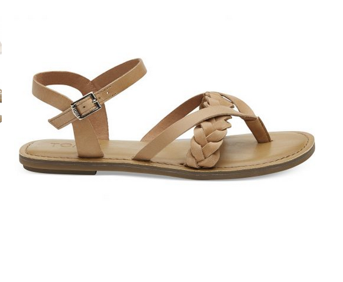
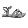
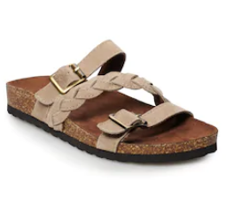
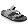
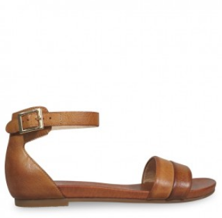
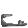
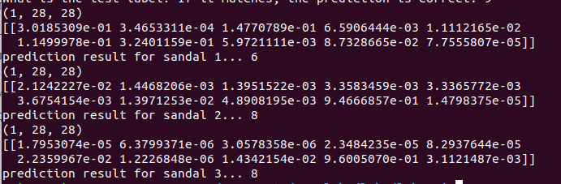
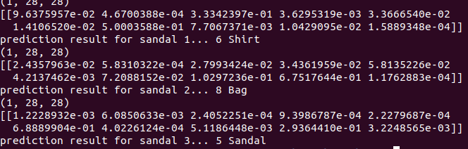

# Lab 9

## Checkpoint 1
  

## Checkpoint 2

## Checkpoint 3
Here are the images I found and their corresponding adjusted images:  
  
  
  
  
  
  
Here are the results from running the program:  
  
Here is another shot at running the program:  
  